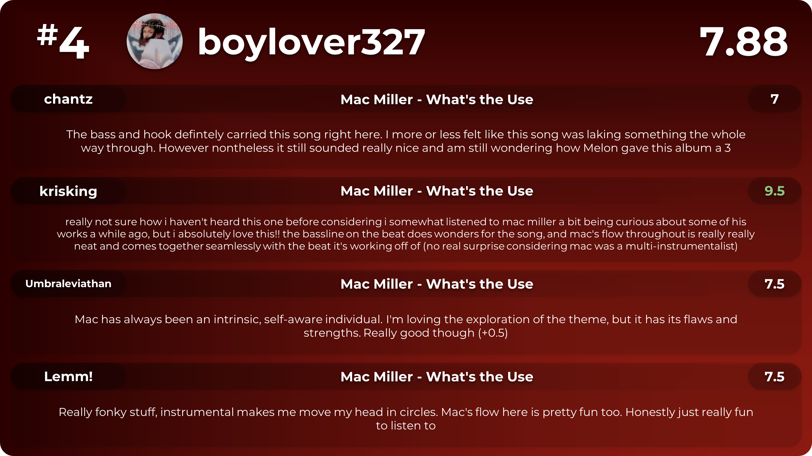

<h1 align="center">Mic Drop Results</h1>

  A program that generates result slides from judging data 
  <a href="https://discord.gg/ZeGWzgvFcR"><b>More info about Mic Drop here</b></a>

<h2 align="center">Installation</h2>

To install, please visit the [latest release](https://github.com/berkeleyfx/mic-drop-results/releases/), download, and extract [**mic-drop-results.zip**](https://github.com/berkeleyfx/mic-drop-results/releases/latest/download/mic-drop-results.zip). Round-dependent files are included in [`/sample`](./sample)

<h2 align="center">Showcase</h2>

  
  
  
  
  

<h2 align="center">Contributing</h2>

All contributions are appreciated. Make sure you follow this [Python Style Guide](https://peps.python.org/pep-0008/) for consistency when making changes to the code.

#### Additional contributions
- Report a bug or suggest a feature [(here)](https://github.com/berkeleyfx/mic-drop-results/issues/new/choose)
- Contact me on Discord for bug reports, suggestions, and support [(here)](https://discord.com/users/1010885414850154587)
